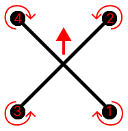

# ASAC FC

**A** **S**imple **A**nd **C**ool **F**light **C**ontroller (ASAC FC) is an flight controller based on the rp2040 microcontroller, that is completely open-source.

## From receiver input to motor outputs

In order to set the correct speeds for each motor several steps must be taken. The steps described below is how it's done for ASAC FC. Note that this is for acro mode only.

1. Read gyro rates from IMU
2. Read receiver input
3. Convert receiver stick inputs to desired gyro rates. This is a mapping from eg. 1000-2000 -> -500 to 500 deg/s.
4. Use the *desired* rates together with the *measured* rates in a pid update to update pid parameters.
5. Use the pid parameters to update the motor outputs.
6. Send the motor outputs to the ESC(s).

## Motor mixing

| Motor | Throttle | Roll | Pitch | Yaw |
| --- | --- | --- | --- | --- |
| 1 | 1 | -1 | 1  | -1 |
| 2 | 1 | -1 | -1 | 1  |
| 3 | 1 | 1  | 1  | 1 |
| 4 | 1 | 1  | -1 | -1  |

## Resources
- [Embedded Programming for Quadcopters](https://www.youtube.com/watch?v=CHSYgLfhwUo&ab_channel=Code%26Supply)
- [Motor mixing](https://oscarliang.com/custom-motor-output-mix-quadcopter/)

