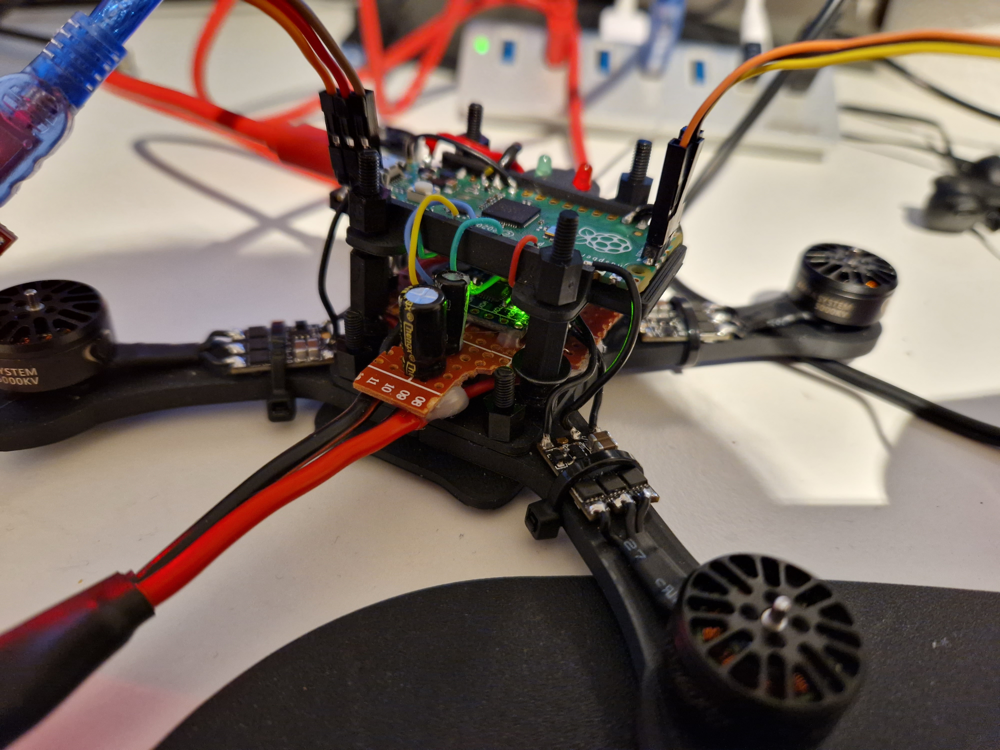

# ASAC FC revision A
For the first revision of the flight controller I designed the PCB in kicad and ordered from JLCPCB. The plan was to solder all components by hand. Unfortunately, I was out of lead-free solder and since I'm not use to working with solder *with* lead, soldering the SMD components such as the IMU (MPU-6050) turned out to be harder than I first anticipated. After several days of struggling, I gave up and switched to using breakout boards and devboard instead.

Raspberry Pi Pico to the rescue, which comes in a rather small package. I also had a breakout board for the IMU. I had to create a power distribution board as well, where the battery will be connected, as well as the ESCs. Even though this does not look as good as a custom PCB, it seems to work just fine.

As you can see on the image above, the pico is mounted on top of the power distribution board, which also hosts the IMU and radio receiver. To program the pico I used a [pico debug probe](https://www.raspberrypi.com/products/debug-probe/) and then connected GPIO0 and GPIO1, which are default UART pins, to an FTDI converter connected to my PC.

This way, it was very convenient to program the flash, while constantly being connected to a serial port to its UART, and also having the capability of debugging in VS Code.
